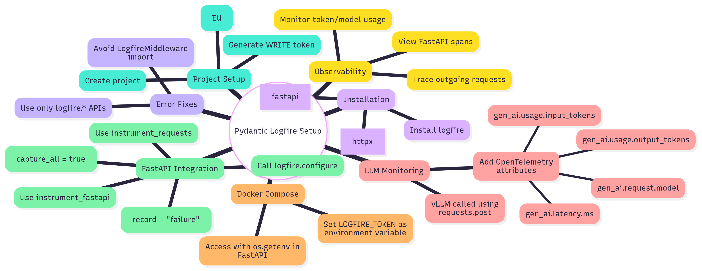

# vLLM GPU-Based Multi-Model Deployment


A production-ready deployment solution for serving multiple language models efficiently using vLLM with GPU acceleration, comprehensive monitoring, and FastAPI backend integration.

## Table of Contents

- [Introduction](#introduction)
- [Models Served](#models-served)
- [Deployment Journey](#deployment-journey)
- [Technical Details](#technical-details)
- [Quick Start Deployment](#quick-start-deployment)
- [Environment Configuration](#environment-configuration)
- [Running the Project](#running-the-project)
- [Monitoring Setup](#monitoring-setup)
- [Testing & Performance](#testing--performance)
- [Credits & References](#credits--references)

---

## Introduction

**vLLM** (Very Large Language Model) is a high-throughput and memory-efficient inference and serving engine for Large Language Models (LLMs). It revolutionizes LLM serving through advanced optimization techniques:

### Key Features

- **KV Cache Optimization**: vLLM implements PagedAttention, which manages attention keys and values in non-contiguous memory pages, similar to how operating systems manage virtual memory. This eliminates memory fragmentation and enables dynamic allocation based on sequence length.

- **Attention Optimization**: Uses advanced attention mechanisms that reduce computational complexity while maintaining model accuracy, enabling faster inference speeds.

- **Efficient GPU Memory Usage**: vLLM maximizes GPU memory utilization through intelligent memory management, allowing larger batch sizes and higher throughput compared to traditional serving methods.

- **GPU Full Utilization**: This deployment ensures complete GPU resource utilization through optimized memory allocation and parallel processing capabilities.

### Project Scope

This project implements a **multi-model serving architecture** with **high concurrency support** using GPU acceleration. The system serves multiple language models simultaneously through separate vLLM containers, enabling efficient resource sharing and scalable inference capabilities for production environments.

---

## Models Served

This deployment serves two specialized SQL generation models optimized for different use cases:

### 1. yasserrmd/Text2SQL-1.5B
- **Repository**: [https://huggingface.co/yasserrmd/Text2SQL-1.5B](https://huggingface.co/yasserrmd/Text2SQL-1.5B)
- **Purpose**: Advanced text-to-SQL generation with 1.5B parameters
- **Port**: 8000
- **Specialization**: Complex query generation and natural language to SQL conversion

### 2. premai-io/prem-1B-SQL  
- **Repository**: [https://huggingface.co/premai-io/prem-1B-SQL](https://huggingface.co/premai-io/prem-1B-SQL)
- **Purpose**: Lightweight SQL generation with 1B parameters
- **Port**: 8001 (when enabled)
- **Specialization**: Fast SQL query generation for real-time applications

Both models are served via **separate vLLM containers** running on different ports, enabling true multi-model support with independent scaling and resource allocation.

---

## Deployment Journey

### Docker Images Built

#### 1. vLLM GPU Image
- **Docker Hub**: [https://hub.docker.com/repository/docker/hamzaak4/vllm-gpu-image/general](https://hub.docker.com/repository/docker/hamzaak4/vllm-gpu-image/general)
- **Features**: GPU-optimized vLLM runtime with CUDA 12.1.1 support
- **Base**: NVIDIA CUDA runtime with Miniconda integration
- **Optimizations**: Rust-compiled dependencies and UV package manager for faster installs

#### 2. FastAPI Backend for vLLM GPU
- **Docker Hub**: [https://hub.docker.com/repository/docker/hamzaak4/fastapi-vllm/general](https://hub.docker.com/repository/docker/hamzaak4/fastapi-vllm/general)
- **Features**: RESTful API interface with model switching capabilities
- **Integrations**: Pydantic Logfire monitoring and Prometheus metrics

### Key Achievements

✅ **Pydantic Logfire Integration**: Implemented comprehensive LLM monitoring in FastAPI backend for request tracing, performance metrics, and error tracking



✅ **Complete Monitoring Stack**: Integrated Prometheus, Grafana, Node Exporter, cAdvisor, and DCGM Exporter for full-stack observability

✅ **Concurrency Testing**: Successfully achieved multi-user concurrent requests with GPU acceleration

✅ **Multi-Model Architecture**: Parallel execution of multiple vLLM containers, each serving different models on dedicated ports

✅ **Production-Ready**: Containerized deployment with proper resource management and monitoring

✅ **Automated Deployment**: One-command deployment script with comprehensive setup and health checks

✅ **Centralized Configuration**: Environment-based configuration system for easy customization and maintenance

---

## Technical Details

### Docker Architecture

This project leverages several key Docker concepts for scalable deployment:

- **Images**: Pre-built containers with vLLM GPU runtime and FastAPI backend
- **Containers**: Isolated runtime environments for each service component  
- **Volumes**: Persistent storage for models and configuration files
- **Docker Compose**: Multi-container orchestration and service management
- **Port Mapping**: Network routing between containers and host system

### Container Naming and Configuration

The deployment uses a centralized naming system that allows customization of container names while maintaining service stability:

- **Service Names**: Static identifiers in docker-compose.yml (required by Docker Compose)
- **Container Names**: Configurable via environment variables for easy identification
- **Network Configuration**: Consistent networking across all services
- **Monitoring Integration**: Prometheus targets automatically use the correct service names

### Prerequisites

- NVIDIA GPU with CUDA support
- Docker with NVIDIA Container Runtime
- Docker Compose v3.8+
- At least 8GB GPU memory (recommended)

---

## Quick Start Deployment

### Automated Deployment Script

The project includes a comprehensive deployment script that handles the entire setup process automatically:

```bash
# Navigate to the project directory
cd Instructstack_vllm_gpu_deployment

# Make the script executable
chmod +x deploy.sh

# Run the full deployment
./deploy.sh
```

### What the Script Does

The deployment script automates the complete setup process:

1. **Prerequisites Check**: Verifies Docker and Docker Compose installation
2. **Environment Setup**: Creates and configures the `.env` file
3. **Directory Creation**: Sets up necessary folders for models and monitoring
4. **Model Management**: Downloads AI models if needed
5. **Service Deployment**: Starts all containers with proper configuration
6. **Health Monitoring**: Verifies services are running correctly
7. **Status Display**: Shows all service URLs and management commands

### Script Options

```bash
./deploy.sh --help      # Show all available options
./deploy.sh --start     # Start services only
./deploy.sh --stop      # Stop services only
./deploy.sh --restart   # Restart all services
./deploy.sh --logs      # Show service logs
./deploy.sh --clean     # Complete cleanup (stop + remove containers)
```

---

## Environment Configuration

### Centralized Configuration System

The project uses a sophisticated environment variable system that provides flexibility while maintaining consistency across all services. Configuration is managed through a single `.env` file created from the provided template.

#### Configuration Methods

**Option 1: .env File (Recommended)**
```bash
# Copy the template and edit with your values
cp env-template.txt .env
nano .env
```

**Option 2: Terminal Export**
```bash
# Set variables in your terminal before running docker-compose
export MAX_NUM_SEQS=20
export GPU_MEMORY_UTILIZATION=0.5
export LOGFIRE_TOKEN="your_actual_logfire_key_here"
export NVIDIA_VISIBLE_DEVICES=1

# Then run docker-compose
docker-compose up
```

**Option 3: Direct Command Line**
```bash
# Set variables directly in the same command line as docker-compose
MAX_NUM_SEQS=20 GPU_MEMORY_UTILIZATION=0.5 docker-compose up
```

#### Running with Default Values
If you want to run the project with the default configuration values defined in docker-compose.yml, simply run:
```bash
docker-compose up
```

#### Customizing Configuration
If you want to customize VLLM parameters, GPU settings, or API endpoints, you can use environment variables in two ways:

#### Key Configurable Variables

| Variable | Default | Description | Example |
|----------|---------|-------------|---------|
| `MAX_NUM_SEQS` | 10 | Maximum concurrent sequences | `20` for high throughput |
| `VLLM_PORT` | 8000 | Primary VLLM server port | `8000` |
| `GPU_MEMORY_UTILIZATION` | 0.3 | GPU memory usage (0.0-1.0) | `0.5` for balanced usage |
| `MAX_MODEL_LEN` | 2048 | Maximum sequence length | `4096` for longer contexts |
| `NVIDIA_VISIBLE_DEVICES` | 0 | GPU device ID | `1` for second GPU |
| `DEFAULT_MODEL` | yasserrmd/Text2SQL-1.5B | Primary model | Custom model path |
| `LOGFIRE_TOKEN` | - | Your Logfire serve key | `pylf_v1_...` |
| `MODEL_REPO_ID` | premai-io/prem-1B-SQL | Model to download | Custom Hugging Face model |
| `MODEL_LOCAL_DIR` | models/premai-io/prem-1B-SQL | Local model directory | Custom local path |
| `MODEL_USE_SYMLINKS` | False | Use symlinks for models | True/False |
| `MODELS_TO_DOWNLOAD` | - | Multiple models (comma-separated) | "model1,model2,model3" |

#### Container Naming Configuration

The system allows customization of container names for better identification and management:

| Variable | Default | Description |
|----------|---------|-------------|
| `VLLM_CONTAINER_NAME` | vllm_server | Primary VLLM container name |
| `VLLM1_CONTAINER_NAME` | vllm_server1 | Secondary VLLM container name |
| `FASTAPI_CONTAINER_NAME` | fastapi-app | FastAPI container name |
| `PROMETHEUS_CONTAINER_NAME` | prometheus | Prometheus container name |
| `GRAFANA_CONTAINER_NAME` | grafana | Grafana container name |
| `CADVISOR_CONTAINER_NAME` | cadvisor | cAdvisor container name |
| `DCGM_EXPORTER_CONTAINER_NAME` | dcgm_exporter | DCGM exporter container name |

#### Secondary VLLM Service Variables
For the second VLLM container (vllm1), use variables with `_1` suffix:
- `MAX_NUM_SEQS_1`: Secondary server sequence limit
- `VLLM_PORT_1`: Secondary server port (default: 8001)
- `GPU_MEMORY_UTILIZATION_1`: Secondary GPU memory usage
- `DEFAULT_MODEL_1`: Secondary model path

#### Example .env File
```bash
# Primary VLLM Configuration
MAX_NUM_SEQS=15
VLLM_PORT=8000
GPU_MEMORY_UTILIZATION=0.4
MAX_MODEL_LEN=4096
NVIDIA_VISIBLE_DEVICES=0
DEFAULT_MODEL=yasserrmd/Text2SQL-1.5B

# Secondary VLLM Configuration  
MAX_NUM_SEQS_1=5
VLLM_PORT_1=8001
GPU_MEMORY_UTILIZATION_1=0.3
DEFAULT_MODEL_1=premai-io/prem-1B-SQL

# FastAPI Configuration
LOGFIRE_TOKEN=pylf_v1_your_actual_key_here
VLLM_API_URL=http://vllm:8000/v1/completions

# Container Naming (Optional)
VLLM_CONTAINER_NAME=my_vllm_server
FASTAPI_CONTAINER_NAME=my_fastapi_app
```

#### What You Can Do With Environment Variables

**1. Optimize Performance for Different Use Cases**
- **High Throughput**: Set `MAX_NUM_SEQS=20` for processing many requests simultaneously
- **Low Latency**: Set `MAX_NUM_SEQS=5` for faster individual response times
- **Memory Optimization**: Adjust `GPU_MEMORY_UTILIZATION` based on your GPU capacity
- **Long Context**: Increase `MAX_MODEL_LEN=4096` for handling longer conversations

**2. Customize Container Names**
- **Production**: Use descriptive names like `prod_vllm_server`
- **Development**: Use names like `dev_vllm_server`
- **Testing**: Use names like `test_vllm_server`

**3. Multi-GPU Support**
- **Primary GPU**: Set `NVIDIA_VISIBLE_DEVICES=0`
- **Secondary GPU**: Set `NVIDIA_VISIBLE_DEVICES=1`
- **Multiple GPUs**: Set `NVIDIA_VISIBLE_DEVICES=0,1`

---

## Running the Project

### Method 1: Automated Deployment (Recommended)

```bash
# Navigate to project directory
cd Instructstack_vllm_gpu_deployment

# Run the deployment script
./deploy.sh
```

### Method 2: Manual Docker Compose

```bash
# Navigate to project directory
cd Instructstack_vllm_gpu_deployment

# Create .env file from template
cp env-template.txt .env

# Edit .env file with your configuration
nano .env

# Start services
docker-compose up -d

# Check status
docker-compose ps

# View logs
docker-compose logs -f
```

### Method 3: Individual Container Management

#### VLLM GPU Container
```bash
# Run yasserrmd/Text2SQL-1.5B model
docker run --gpus all -p 8000:8000 \
  -v ./models:/models \
  hamzaak4/vllm-gpu-image:latest \
  --model yasserrmd/Text2SQL-1.5B \
  --gpu-memory-utilization 0.3 \
  --port 8000

# Run premai-io/prem-1B-SQL model  
docker run --gpus all -p 8001:8001 \
  -v ./models:/models \
  hamzaak4/vllm-gpu-image:latest \
  --model premai-io/prem-1B-SQL \
  --gpu-memory-utilization 0.3 \
  --port 8001
```

#### FastAPI Backend Container
```bash
docker run -p 9000:9000 \
  -e VLLM_API_URL=http://localhost:8000/v1/completions \
  -e LOGFIRE_TOKEN=your_logfire_token \
  hamzaak4/fastapi-vllm:latest
```

### API Usage Examples

#### cURL Examples
```bash
# Test model completion
curl -X POST "http://localhost:8000/v1/completions" \
  -H "Content-Type: application/json" \
  -d '{
    "model": "yasserrmd/Text2SQL-1.5B",
    "prompt": "Generate SQL to find all users with age greater than 25",
    "max_tokens": 100,
    "temperature": 0.7
  }'

# Health check
curl http://localhost:8000/health
```

#### Postman Collection
Create a new request with:
- **Method**: POST
- **URL**: `http://localhost:9000/api/generate`
- **Headers**: `Content-Type: application/json`
- **Body**:
```json
{
  "prompt": "Create a SQL query to select all products with price > 100",
  "max_tokens": 150,
  "temperature": 0.5
}
```

---

## Monitoring Setup

### Comprehensive Observability Stack

#### Prometheus Metrics Collection
Prometheus scrapes metrics from multiple sources every 5 seconds with enhanced configuration:

- **vLLM GPU Containers** (ports 8000, 8001):
  - Request latency and throughput
  - GPU memory utilization  
  - Model inference metrics
  - Queue lengths and batch sizes

- **FastAPI Backend** (port 9000):
  - HTTP request metrics
  - API endpoint performance
  - Error rates and status codes
  - Custom business metrics

- **Node Exporter** (port 9100):
  - System CPU, memory, disk usage
  - Network interface statistics
  - Filesystem metrics

- **cAdvisor** (port 8080):
  - Container resource usage
  - Memory and CPU consumption per container
  - Container health status

- **DCGM Exporter** (port 9400):
  - GPU utilization and temperature
  - GPU memory usage
  - Power consumption
  - SM (Streaming Multiprocessor) utilization

#### Enhanced Prometheus Configuration

The monitoring system now includes:
- **Dynamic Job Names**: Uses container names for better metric identification
- **Service Labels**: Enhanced labeling for improved metric organization
- **Comprehensive Comments**: Detailed explanations for each monitoring target
- **Environment Integration**: Seamless integration with the container naming system

#### Grafana Dashboards
Grafana (port 3000) provides pre-configured dashboards for:
- **GPU Performance**: Real-time GPU metrics and utilization
- **Container Metrics**: Resource usage across all services  
- **API Performance**: Request rates, latency percentiles, error tracking
- **System Overview**: Host system performance and health

#### Pydantic Logfire Integration
Advanced LLM monitoring capabilities with improved error handling:
- **Request Tracing**: Complete request lifecycle tracking
- **Performance Analytics**: Inference time analysis and optimization insights
- **Error Monitoring**: Detailed error tracking and debugging information
- **Model Performance**: Token generation rates and model efficiency metrics
- **Graceful Fallback**: Continues operation even if Logfire configuration fails

### Accessing Monitoring

1. **Grafana**: http://localhost:3000 (admin/admin)
2. **Prometheus**: http://localhost:9090  
3. **Logfire Dashboard**: Access via your Pydantic Logfire account
4. **Individual Exporters**: Available on their respective ports

---

## Testing & Performance

### Concurrency Testing

The project includes an advanced concurrency testing script that provides comprehensive performance analysis:

```bash
# Run the concurrency test
python3 concurrency_test.py

# Customize test parameters via environment variables
CONCURRENCY=20 REQUESTS_PER_CLIENT=10 python3 concurrency_test.py
```

#### Test Features

- **Multi-User Simulation**: Simulates multiple concurrent users
- **Performance Metrics**: Response time analysis and throughput calculation
- **Error Handling**: Comprehensive error tracking and categorization
- **Configurable Parameters**: Adjustable concurrency levels and request counts
- **Real-time Monitoring**: Live feedback during test execution
- **Summary Statistics**: Detailed performance reports

#### Test Configuration

The concurrency test supports various configuration options:

| Variable | Default | Description |
|----------|---------|-------------|
| `CONCURRENCY` | 10 | Number of concurrent users |
| `REQUESTS_PER_CLIENT` | 5 | Requests per user |
| `REQUEST_TIMEOUT` | 30 | Request timeout in seconds |
| `MAX_TOKENS` | 128 | Maximum tokens in response |
| `TEMPERATURE` | 0.3 | Response temperature |

#### Performance Analysis

The test provides comprehensive performance insights:
- **Response Time Statistics**: Average, minimum, and maximum response times
- **Success/Failure Rates**: Percentage of successful vs. failed requests
- **Throughput Calculation**: Requests per second processing capability
- **Error Categorization**: Detailed breakdown of different error types
- **Resource Utilization**: GPU and system resource usage during testing

### Load Testing Scenarios

**High Concurrency Testing**
```bash
CONCURRENCY=50 REQUESTS_PER_CLIENT=20 python3 concurrency_test.py
```

**Stress Testing**
```bash
CONCURRENCY=100 REQUESTS_PER_CLIENT=50 python3 concurrency_test.py
```

**Performance Benchmarking**
```bash
CONCURRENCY=10 REQUESTS_PER_CLIENT=100 python3 concurrency_test.py
```

---

## Credits & References

### Documentation & Resources
- **vLLM Documentation**: [https://docs.vllm.ai/](https://docs.vllm.ai/)
- **vLLM GitHub Repository**: [https://github.com/vllm-project/vllm](https://github.com/vllm-project/vllm)
- **Pydantic Logfire**: [https://logfire.pydantic.dev/](https://logfire.pydantic.dev/)
- **NVIDIA DCGM**: [https://docs.nvidia.com/datacenter/dcgm/](https://docs.nvidia.com/datacenter/dcgm/)

### Model Repositories
- **yasserrmd/Text2SQL-1.5B**: [https://huggingface.co/yasserrmd/Text2SQL-1.5B](https://huggingface.co/yasserrmd/Text2SQL-1.5B)
- **premai-io/prem-1B-SQL**: [https://huggingface.co/premai-io/prem-1B-SQL](https://huggingface.co/premai-io/prem-1B-SQL)

### Docker Images  
- **vLLM GPU Image**: [https://hub.docker.com/repository/docker/hamzaak4/vllm-gpu-image/general](https://hub.docker.com/repository/docker/hamzaak4/vllm-gpu-image/general)
- **FastAPI vLLM Backend**: [https://hub.docker.com/repository/docker/hamzaak4/fastapi-vllm/general](https://hub.docker.com/repository/docker/hamzaak4/fastapi-vllm/general)

### Technology Stack
- **FastAPI**: High-performance Python web framework
- **Prometheus**: Time-series monitoring and alerting
- **Grafana**: Metrics visualization and dashboarding  
- **Docker & Docker Compose**: Containerization and orchestration
- **NVIDIA CUDA**: GPU acceleration framework

---

## Contributing

Contributions are welcome! Please feel free to submit issues, feature requests, or pull requests to improve this deployment solution.

## License

This project is open source and available under the [MIT License](LICENSE).

---

*Built with ❤️ for efficient LLM serving and GPU optimization*
